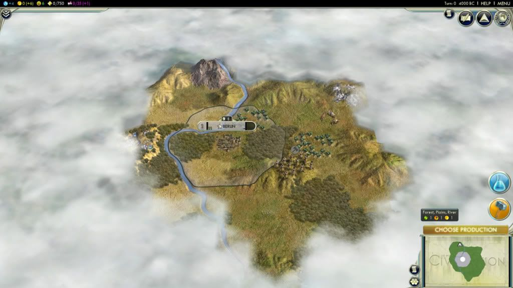
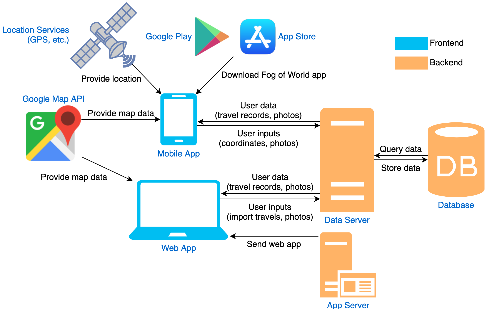

# Fog of World
*Fog of World* is an mobile/web application that borrows the idea of [**fog of war**](https://en.wikipedia.org/wiki/Fog_of_war#In_video_games) (a concept in strategy games meaning you can only see the part of game map where you have visited, see image below) to encourage people to travel and physically discover the world.

The application provides incentives for travelling by only showing the part of the world map where the user has physically been to, and covering the rest of map with a thin layer of fog.

## Purpose
My original intention for starting this project was to familiarize myself with the [Spring](https://spring.io/) framework by actually writing a usable web app with Spring Boot. The project is supposed to be another stepping stone on my [roadmap](https://github.com/kamranahmedse/developer-roadmap#back-end-roadmap) of becoming a full-fledged backend developer, and an improvement upon my previous web development project [*Commentaria*](https://github.com/WilliamYuhangLee/Commentaria).

The scope of the project was limited to building just the backend server. However as the development progressed I realized having a frontend would make it so much more convenient to do data generation and testing. So I decided to expand the project to include the frontend components, which consist of a mobile app for collecting location data and a web app for displaying data and easier debugging (see [Architecture](#architecture) for details).

## Architecture
Below is a diagram that shows how the major components of *Fog of World* are connected:

### Backend
The backend part of the application consists of a data server, a web app server and a database.

#### Data Server
The data server provides a RESTful API as an interface to communicate with frontend clients. Both the mobile app and the web app talk to this server to upload or download data.

The RESTful API is written in Java using the Spring framework. The structure of the API can be described as 3 layers:
* **Controller layer**: receive and verify incoming requests from clients, extract DTOs and route them to corresponding services, formulate responses and send them back to clients.
* **Service layer**: take in DTOs from controllers, perform business logic, manipulate data by calling persistence layer.
* **Domain model & persistence layer**: manage domain models, repository interfaces and their implementations, store and retrieve data from the database.

The data server also has Spring Security filters laid in front of the controller layer. The filters intercept unauthenticated or unauthorized requests, send back corresponding error codes. Among them are two custom JWT filters that create JWT tokens for successfully authenticated requests and verify them in order to save the hassle of repeated authentication.

#### Web App Server
This server is relatively simple compared to the data server. It simply serves up frontend web app scripts when clients request for them.

#### Database
The database stores internal data and is managed by the persistence layer of the data server through JPA.

### Frontend
The frontend consists of two clients: a mobile app (Android) and a web app (React).

#### Mobile App
The mobile app serves as the primary source of data thanks to the location services prevalent on mobile devices. It is also the primary user interface of the application.

#### Web App
The web app serves as a display tool for data and an easily accessible data interface for debug purposes.

## Features
This is a non-exhaustive list of designed features. More will be added in as the development goes on.
* User can upload their current location as a single record point
* User may also upload photos and associate them with a record point, and they may choose to share them publicly.
* User can record a journey by turning on location tracking service, and then upload the journey
* User can see a list of their travel records
* User can see a map with their footprints rendered on it (rest of the map should be covered by fog)
* User will obtain achievements and be awarded badges if they complete travelling challenges (e.g. been present on all continents of the world)
* User can see locations on the map where photos have been taken and shared by other users.

## Built with
* Backend
    * See [build.gradle](/server/build.gradle) for a definitive list of dependencies
    * [Spring](https://spring.io/) (Boot, Web, Data, Security) - web framework used for server
    * [JJWT](https://java.jsonwebtoken.io/) - Java JWT library
    * [Lombok](https://projectlombok.org/) - Java efficiency utility library (no more boilerplate codes!) 
 * Frontend
    * Mobile App
        * [Android](https://www.android.com/) - Mobile platform the app is developed on
    * Web App
        * [React](https://reactjs.org/) - Web app framework
        * [Lodash](https://lodash.com/) - JavaScript utility library
    

## Author
* [**Yuhang Li**](https://github.com/WilliamYuhangLee) - Architect, backend developer (also frontend & UI *for now*)
* ? - web frontend developer
* ? - mobile developer
* ? - UI designer

## Contributing
As the primary purpose of this project is to facilitate learning, anyone willing to practice their developing skills in frontend web app, mobile app, UI design may contact me to participate. Though the backend part of the project is mostly done, you are welcome to make improvements, add new features and/or give suggestions to the current codebase. 

## License
You are free to view, download and modify the code as you want for learning, but you are not allowed to redistribute the source code or use it for commercial purposes.

## References
Below are some useful tutorials/references that I came across during this project. Give them a good read and you may soon have your epiphany!
* Spring Framework
    * [String Boot Starter Kit](https://github.com/khandelwal-arpit/springboot-starterkit) - small template Spring Boot project for beginners
    * [Spring Boot 2.0 — Project Structure and Best Practices](https://medium.com/the-resonant-web/spring-boot-2-0-starter-kit-part-1-23ddff0c7da2)
    * [Entity To DTO Conversion](https://www.baeldung.com/entity-to-and-from-dto-for-a-java-spring-application)
    * [Guide to Spring Data JPA](https://docs.spring.io/spring-data/jpa/docs/current/reference/html/#reference)
    * [Spring Security for a REST API](https://www.baeldung.com/securing-a-restful-web-service-with-spring-security)
    * [Spring Boot application.properties file](http://dolszewski.com/spring/spring-boot-application-properties-file/)
    * [Guide to @ConfigurationProperties in Spring Boot](https://www.baeldung.com/configuration-properties-in-spring-boot) - how to programmatically read and validate properties
* JWT authentication
    * [Implementing JWT with Spring Boot and Spring Security](https://medium.com/@xoor/jwt-authentication-service-44658409e12c)
    * [Implementing JWT Authentication on Spring Boot APIs](https://auth0.com/blog/implementing-jwt-authentication-on-spring-boot/#Securing-RESTful-APIs-with-JWTs)
    * [JWT control flow well explained](https://dzone.com/articles/spring-boot-security-json-web-tokenjwt-hello-world)
* REST API
    * [User registration/authentication flow on a REST API](https://stackoverflow.com/questions/27876306/user-registration-authentication-flow-on-a-rest-api)
* Meta
    * README templates
        * [PurpleBooth](https://gist.github.com/PurpleBooth/109311bb0361f32d87a2)
        * [fvcproductions](https://gist.github.com/fvcproductions/1bfc2d4aecb01a834b46)
        * [dbader](https://github.com/dbader/readme-template)
    * [GitHub Mastering Markdown](https://guides.github.com/features/mastering-markdown/)
    * [draw.io](https://www.draw.io/) - easily make UML diagrams
    * [Choose an open source license](https://choosealicense.com/)
    * [Choose README badges](https://shields.io/)
    
Special thanks to the authors of all the above resources! 
